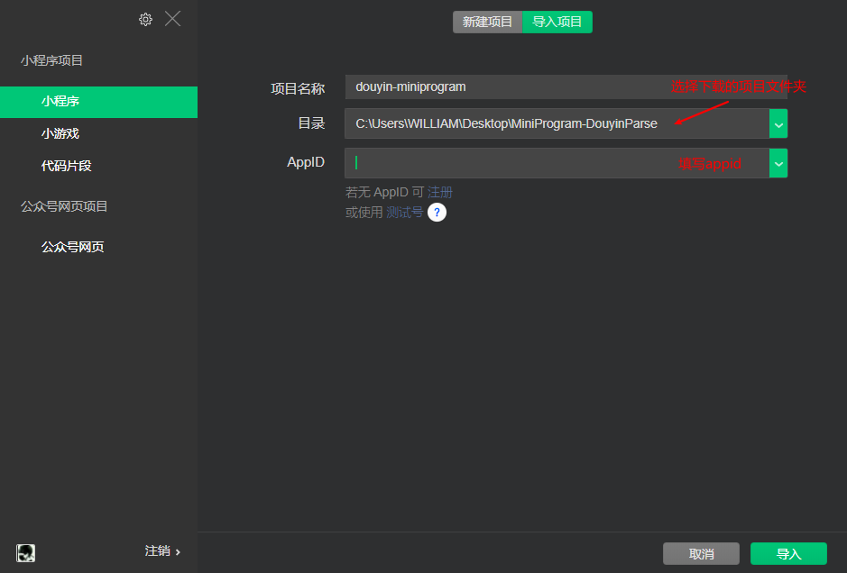
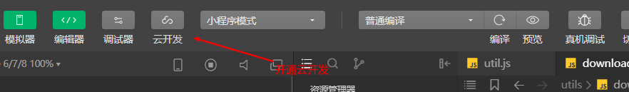
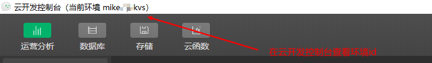
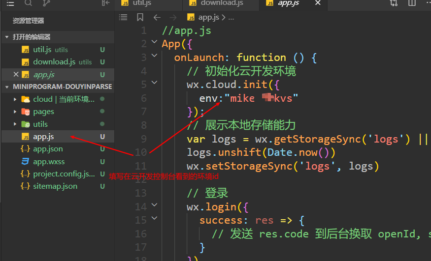
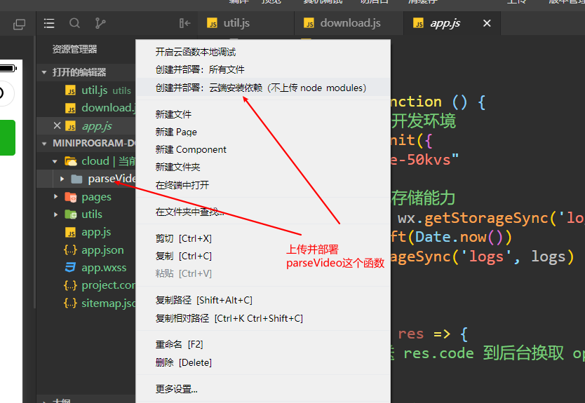
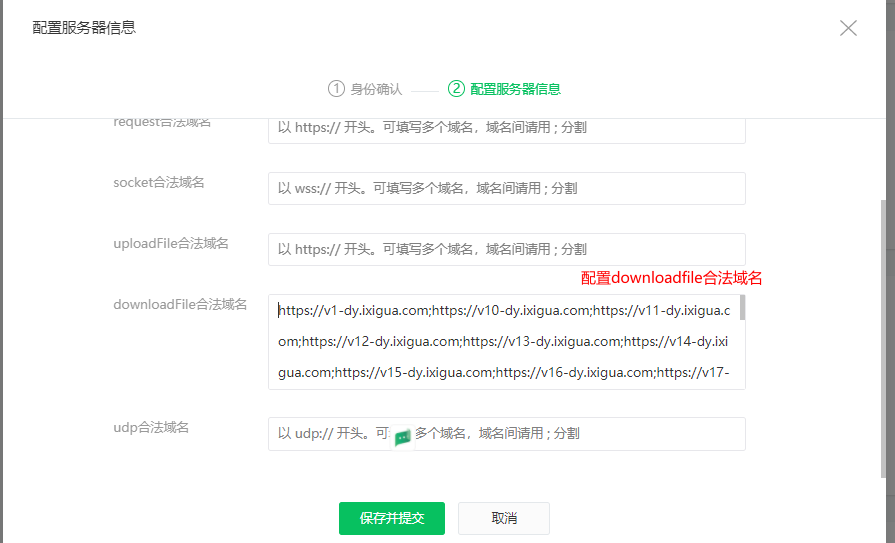
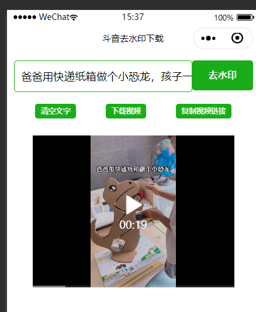

# 体验二维码
.jpg)  

UI 比较丑不要介意，功能还是在的  

# 使用方法

## 注册小程序

https://mp.weixin.qq.com/  
登录小程序后台,在 开发 - 开发设置 中复制小程序 **AppID** 备用    

## 下载微信开发者工具
https://developers.weixin.qq.com/miniprogram/dev/devtools/download.html

## 下载源码 并在微信开发者工具导入项目

源码地址  
```
https://github.com/skygongque/MiniProgram-DouyinParse
```

## 开通云开发


## 查看云开发的环境id


## 初始化云开发环境


## 上传并部署云函数


## 小程序后台 配置downloadFile合法域名


2021.8.28更新的downloadfile合法域名如下。  
修改小程序后台的downloadfile合法域名后需刷新项目配置并**重新编译**才生效。
```
https://txmov2.a.yximgs.com;https://v1-cold.douyinvod.com;https://v1-y.douyinvod.com;https://v1.douyinvod.com;https://v11-x.douyinvod.com;https://v11.douyinvod.com;https://v26-cold.douyinvod.com;https://v26.douyinvod.com;https://v29-cold.douyinvod.com;https://v29.douyinvod.com;https://v3-a.douyinvod.com;https://v3-b.douyinvod.com;https://v3-c.douyinvod.com;https://v3-cold.douyinvod.com;https://v3-d.douyinvod.com;https://v3-e.douyinvod.com;https://v3-x.douyinvod.com;https://v3-y.douyinvod.com;https://v3-z.douyinvod.com;https://v5-cold.douyinvod.com;https://v5-coldb.douyinvod.com;https://v5-coldc.douyinvod.com;https://v5-coldy.douyinvod.com;https://v5-e.douyinvod.com;https://v5-f.douyinvod.com;https://v5-g.douyinvod.com;https://v5-h.douyinvod.com;https://v5-i.douyinvod.com;https://v5-j.douyinvod.com;https://v6-cold.douyinvod.com;https://v6-x.douyinvod.com;https://v6-y.douyinvod.com;https://v6-z.douyinvod.com;https://v6.douyinvod.com;https://v83-c.douyinvod.com;https://v83-d.douyinvod.com;https://v83-x.douyinvod.com;https://v83-y.douyinvod.com;https://v83-z.douyinvod.com;https://v83.douyinvod.com;https://v9-cold.douyinvod.com;https://v9-x.douyinvod.com;https://v9-z.douyinvod.com;https://v9.douyinvod.com;https://v95.douyinvod.com;
```
> 添加更多抖音域名需要保持[云函数](./cloud/parseVideo/index.js)的91行与配置的合法域名一致才有效。


## 复制抖音分享链接使用, 可以上传提交审核 发布

